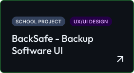

# Hey there, GitHub explorer! 👋 Let's introduce ourselves...
I'm Samuel, and I live at the intersection of design systems and front-end engineering. Graduated as Web Developer at ITS ICT in Turin, I later dove into UX/UI Design, and somehow ended up as the person everyone calls when they need to "change the color of a button". 

Detail-obsessed, allergic to "it works on my machine." I break problems into layers, checking specs before trusting vibes, and asking questions more than is probably healthy.

## Okay, so what I actually do? 🤔
Half designer and half developer, I like experimenting on new designs, working on my portfolio (one day it will finally release, I swear), drinking coffee, and bringing fancy ideas to life. 
Currently, I'm a designer maintaining the company's design system and component library at AlpitourWorld.
<!--
## My Certifications
  tenere commentato perchè non ce ne sono
-->

## My Fav Stack and Tools ⚙️
\> **Figma** for designing, **React + Typescript** when i want to build some new project nobody asked for.

\> Also worked with **HTML**, **CSS**, **SCSS**, **JS**, **TS**, **Tailwind**, **React**, **Angular**, **Storybook**, **MUI**, **Style Dictionary**.

\> Spent some time messing around with coding agents like **Claude Code** and **Github Copilot**. 

\> Currently learning **Three.js** and **Framer Motion**, mostly to see how much animations i can stack before someone stops me.

## My Designs 🎨
 Here's what I've been busy doing in Figma, recently:
 
 

## Enough about me — see you on the next repo 🚀
Let's connect if you're into design systems, want to share some ideas, collaborate, or just to chill while drinking a coffee ☕ or a spritz 🍹 together.
